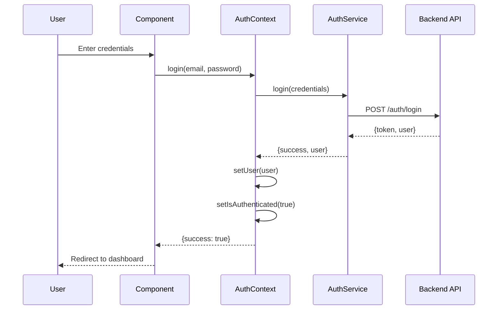

# FlowService - Complete Documentation

## Table of Contents
1. [Getting Started](#getting-started)
2. [GitHub Setup & Installation](#github-setup--installation)
3. [Project Architecture](#project-architecture)
4. [File Structure](#file-structure)
5. [Module Documentation](#module-documentation)
6. [Database Schema](#database-schema)
7. [Authentication System](#authentication-system)
8. [Development Guidelines](#development-guidelines)

---

## Getting Started

### Prerequisites
- Node.js (v18 or higher)
- npm or bun package manager
- Git
- GitHub account
- Code editor (VS Code recommended)

---

## GitHub Setup & Installation

### Step 1: Install Git
Download and install Git from [https://git-scm.com/downloads](https://git-scm.com/downloads)

**Verify installation:**
```bash
git --version
```

### Step 2: Configure Git with Your Profile
```bash
# Set your username
git config --global user.name "Your Name"

# Set your email
git config --global user.email "your.email@example.com"

# Verify configuration
git config --list
```

### Step 3: Connect to GitHub

1. **Create GitHub Account**: Visit [https://github.com](https://github.com) and sign up

2. **Generate SSH Key** (Recommended):
```bash
# Generate SSH key
ssh-keygen -t ed25519 -C "your.email@example.com"

# Start SSH agent
eval "$(ssh-agent -s)"

# Add SSH key
ssh-add ~/.ssh/id_ed25519

# Copy public key to clipboard (Mac/Linux)
cat ~/.ssh/id_ed25519.pub | pbcopy

# On Windows
clip < ~/.ssh/id_ed25519.pub
```

3. **Add SSH Key to GitHub**:
   - Go to GitHub → Settings → SSH and GPG keys
   - Click "New SSH key"
   - Paste your public key
   - Click "Add SSH key"

4. **Test Connection**:
```bash
ssh -T git@github.com
```

### Step 4: Clone the Repository

```bash
# Navigate to your projects folder
cd ~/projects

# Clone the repository
git clone https://github.com/ihebchebbi1998tn/StaticFrontEnd.git

# Navigate into project
cd StaticFrontEnd

# Install dependencies
npm install
# or
bun install
```

### Step 5: Run the Application

```bash
# Start development server
npm run dev
# or
bun run dev
```

The application will be available at `http://localhost:8080`

---

## Project Architecture

### Technology Stack

**Frontend Framework:**
- React 18.3.1
- TypeScript
- Vite (Build tool)

**UI Components:**
- Radix UI (Headless components)
- shadcn/ui (Component library)
- Tailwind CSS (Styling)
- Lucide React (Icons)

**State Management:**
- React Context API
- TanStack Query (Server state)

**Routing:**
- React Router DOM v6

**Form Management:**
- React Hook Form
- Zod (Validation)

**Additional Libraries:**
- date-fns (Date manipulation)
- axios (HTTP client)
- recharts (Data visualization)
- react-big-calendar (Calendar views)
- leaflet (Maps)
- i18next (Internationalization)

### Application Structure

```
FlowService/
├── Frontend (React SPA)
│   ├── Authentication Layer
│   ├── Module System (CRM + Field Service)
│   └── UI Components
└── Backend (Lovable Cloud/Supabase)
    ├── PostgreSQL Database
    ├── Authentication
    └── Edge Functions
```

---

## File Structure

```
src/
├── components/           # Reusable UI components
│   ├── ui/              # Base UI components (shadcn/ui)
│   ├── layout/          # Layout components
│   └── shared/          # Shared business components
│
├── modules/             # Business logic modules
│   ├── analytics/       # Analytics & reporting
│   ├── articles/        # Product/service catalog
│   ├── calendar/        # Event scheduling
│   ├── contacts/        # Contact management (CRM)
│   ├── dashboard/       # Main dashboard
│   ├── deals/           # Deal management
│   ├── dispatcher/      # Job dispatching
│   ├── documents/       # Document management
│   ├── field/           # Field service operations
│   ├── inventory-services/ # Inventory tracking
│   ├── lookups/         # Reference data
│   ├── offers/          # Quote/offer management
│   ├── sales/           # Sales pipeline
│   ├── scheduling/      # Technician scheduling
│   ├── settings/        # App settings
│   ├── skills/          # Skill management
│   ├── support/         # Customer support
│   ├── tasks/           # Task management
│   ├── users/           # User management
│   └── workflow/        # Workflow automation
│
├── contexts/            # React contexts
│   └── AuthContext.tsx  # Authentication state
│
├── services/            # API services
│   └── mockAuthService.ts
│
├── lib/                 # Utility functions
│   └── utils.ts
│
├── hooks/               # Custom React hooks
│
├── pages/               # Page components
│
├── i18n/                # Internationalization
│   └── locales/         # Translation files
│
├── assets/              # Static assets
│
└── types/               # TypeScript type definitions
```

---

## Module Documentation

### Module Structure

Each module follows this standard structure:

```
module-name/
├── components/          # UI components specific to module
├── types.ts            # TypeScript interfaces
├── services/           # Business logic & API calls
├── migrations/         # Database schema definitions
└── documentation/      # Module documentation
    └── README.md
```

---

### 1. **Analytics Module** 📊

**Purpose:** Business intelligence, reporting, and data visualization

**Key Features:**
- Performance metrics
- Revenue analytics
- Service order statistics
- Technician performance tracking

**File Structure:**
```
analytics/
├── components/
│   ├── RevenueChart.tsx       # Revenue visualization
│   ├── PerformanceMetrics.tsx # KPI dashboard
│   └── ReportBuilder.tsx      # Custom reports
├── types.ts                   # Analytics data types
└── services/
    └── analytics.service.ts   # Data aggregation
```

**Types Example:**
```typescript
interface AnalyticsMetrics {
  totalRevenue: number;
  completedJobs: number;
  averageJobDuration: number;
  technicianUtilization: number;
  customerSatisfaction: number;
}
```

**Usage:**
```typescript
import { AnalyticsService } from '@/modules/analytics/services';

const metrics = await AnalyticsService.getMonthlyMetrics(2024, 10);
```

---

### 2. **Articles Module** 📦

**Purpose:** Product and service catalog management

**Key Features:**
- Product inventory
- Service catalog
- Pricing management
- Stock tracking

**File Structure:**
```
articles/
├── components/
│   ├── ArticleList.tsx        # Product listing
│   ├── ArticleForm.tsx        # Add/edit products
│   └── StockManager.tsx       # Inventory control
├── types.ts                   # Product types
└── documentation/
    └── README.md
```

**Types Example:**
```typescript
interface Article {
  id: string;
  code: string;
  name: string;
  type: 'product' | 'service';
  category: string;
  price: number;
  stock: number;
  unit: string;
  description: string;
}
```

**Usage:**
```typescript
// Create new article
const article = {
  code: 'PROD-001',
  name: 'Solar Panel 300W',
  type: 'product',
  price: 299.99,
  stock: 50
};
```

---

### 3. **Calendar Module** 📅

**Purpose:** Event scheduling and calendar management

**Key Features:**
- Event creation
- Calendar views (day, week, month)
- Event categories
- Recurring events

**File Structure:**
```
calendar/
├── components/
│   ├── CalendarView.tsx       # Main calendar
│   ├── EventForm.tsx          # Event creation
│   └── EventDetails.tsx       # Event display
├── types.ts
└── services/
    └── calendar.service.ts
```

**Types Example:**
```typescript
interface CalendarEvent {
  id: string;
  title: string;
  start: Date;
  end: Date;
  type: 'meeting' | 'call' | 'task' | 'reminder';
  relatedTo?: string;
  relatedType?: 'contact' | 'sale' | 'service_order';
  attendees: string[];
}
```

---

### 4. **Contacts Module** 👥

**Purpose:** Customer relationship management (CRM)

**Key Features:**
- Contact database
- Company management
- Contact segmentation
- Activity tracking

**File Structure:**
```
contacts/
├── components/
│   ├── ContactList.tsx        # Contact directory
│   ├── ContactDetails.tsx     # Contact profile
│   ├── ContactForm.tsx        # Add/edit contact
│   └── ActivityTimeline.tsx   # Contact history
├── types.ts
├── services/
│   └── contacts.service.ts
└── migrations/
    └── 001_crm_tables.json
```

**Types Example:**
```typescript
interface Contact {
  id: string;
  firstName: string;
  lastName: string;
  email: string;
  phone: string;
  company: string;
  type: 'lead' | 'customer' | 'partner';
  status: 'active' | 'inactive';
  address: Address;
  tags: string[];
  createdAt: Date;
}
```

**Database Schema:**
```json
{
  "table": "CRM.contacts",
  "fields": {
    "id": "uuid",
    "first_name": "string",
    "last_name": "string",
    "email": "string",
    "phone": "string",
    "company": "string",
    "type": "enum",
    "status": "enum"
  }
}
```

---

### 5. **Dashboard Module** 🏠

**Purpose:** Main application dashboard and overview

**Key Features:**
- KPI widgets
- Quick actions
- Recent activity
- Data visualization

**File Structure:**
```
dashboard/
├── components/
│   ├── DashboardLayout.tsx    # Main layout
│   ├── KPIWidget.tsx          # Metric cards
│   ├── QuickActions.tsx       # Action buttons
│   └── RecentActivity.tsx     # Activity feed
└── types.ts
```

---

### 6. **Deals Module** 💼

**Purpose:** Sales opportunity tracking

**Key Features:**
- Deal pipeline
- Stage management
- Win/loss tracking
- Deal value calculation

**File Structure:**
```
deals/
├── components/
│   ├── DealPipeline.tsx       # Kanban board
│   ├── DealCard.tsx           # Deal display
│   └── DealForm.tsx           # Deal creation
└── types.ts
```

**Types Example:**
```typescript
interface Deal {
  id: string;
  title: string;
  contactId: string;
  value: number;
  stage: 'lead' | 'qualified' | 'proposal' | 'negotiation' | 'closed';
  probability: number;
  expectedCloseDate: Date;
  assignedTo: string;
}
```

---

### 7. **Dispatcher Module** 🚗

**Purpose:** Real-time job dispatching and technician coordination

**Key Features:**
- Job assignment
- Technician tracking
- Route optimization
- Real-time updates

**File Structure:**
```
dispatcher/
├── components/
│   ├── DispatchingInterface.tsx  # Main dispatch view
│   ├── CustomCalendar.tsx        # Scheduling calendar
│   ├── UnassignedJobsList.tsx    # Job queue
│   └── TechnicianCard.tsx        # Technician status
├── types.ts
└── services/
    └── dispatcher.service.ts
```

**Types Example:**
```typescript
interface Job {
  id: string;
  serviceOrderId: string;
  title: string;
  priority: 'low' | 'medium' | 'high' | 'urgent';
  status: 'pending' | 'assigned' | 'in_progress' | 'completed';
  technicianId?: string;
  scheduledStart: Date;
  scheduledEnd: Date;
  location: Location;
  skills: string[];
}

interface Technician {
  id: string;
  name: string;
  status: 'available' | 'busy' | 'off_duty';
  skills: string[];
  currentLocation: Location;
  assignedJobs: Job[];
}
```

**Key Functions:**
```typescript
class DispatcherService {
  // Get all unassigned jobs
  getUnassignedJobs(): Job[]
  
  // Assign job to technician
  assignJob(jobId: string, technicianId: string, 
            scheduledStart: Date, scheduledEnd: Date): Promise<void>
  
  // Get available technicians
  getTechnicians(): Technician[]
  
  // Update job status
  updateJobStatus(jobId: string, status: JobStatus): Promise<void>
}
```

---

### 8. **Documents Module** 📄

**Purpose:** Document management and file attachments

**Key Features:**
- File upload
- Document categorization
- Version control
- Access permissions

**File Structure:**
```
documents/
├── components/
│   ├── DocumentList.tsx       # Document browser
│   ├── DocumentUpload.tsx     # File upload
│   └── DocumentViewer.tsx     # Document preview
└── types.ts
```

**Types Example:**
```typescript
interface Document {
  id: string;
  name: string;
  type: 'pdf' | 'image' | 'word' | 'excel';
  size: number;
  url: string;
  relatedTo: string;
  relatedType: 'contact' | 'sale' | 'service_order';
  uploadedBy: string;
  uploadedAt: Date;
}
```

---

### 9. **Field Module** 🔧

**Purpose:** Field service management core functionality

**Key Features:**
- Service orders
- Installation tracking
- Equipment management
- Field inventory

**File Structure:**
```
field/
├── components/
│   ├── ServiceOrderList.tsx   # Service order listing
│   ├── ServiceOrderForm.tsx   # Create/edit orders
│   ├── InstallationCard.tsx   # Installation details
│   └── FieldInventory.tsx     # Equipment tracking
├── types.ts
├── services/
│   └── field.service.ts
└── migrations/
    └── 001_field_tables.json
```

**Types Example:**
```typescript
interface ServiceOrder {
  id: string;
  orderNumber: string;
  contactId: string;
  type: 'installation' | 'maintenance' | 'repair';
  status: 'pending' | 'scheduled' | 'in_progress' | 'completed';
  priority: 'low' | 'medium' | 'high' | 'urgent';
  scheduledDate: Date;
  location: Location;
  assignedTechnician?: string;
  items: ServiceItem[];
  notes: string;
}

interface Installation {
  id: string;
  serviceOrderId: string;
  installationCode: string;
  type: string;
  location: Location;
  status: 'planned' | 'in_progress' | 'completed';
  equipment: Equipment[];
}
```

**Database Schema:**
```json
{
  "tables": [
    {
      "name": "FIELD.service_orders",
      "fields": {
        "id": "uuid",
        "order_number": "string",
        "contact_id": "uuid",
        "type": "enum",
        "status": "enum",
        "priority": "enum"
      }
    },
    {
      "name": "FIELD.installations",
      "fields": {
        "id": "uuid",
        "service_order_id": "uuid",
        "installation_code": "string",
        "type": "string"
      }
    }
  ]
}
```

---

### 10. **Inventory-Services Module** 📋

**Purpose:** Inventory and services catalog management

**Key Features:**
- Service definitions
- Inventory tracking
- Stock alerts
- Service pricing

---

### 11. **Lookups Module** 🔍

**Purpose:** Reference data and configuration

**Key Features:**
- System lookups
- Dropdown values
- Configuration tables
- Reference data

**File Structure:**
```
lookups/
├── types.ts
├── services/
│   └── lookups.service.ts
└── migrations/
    └── 001_lookup_tables.json
```

**Types Example:**
```typescript
interface Lookup {
  id: string;
  category: string;
  code: string;
  label: string;
  value: string;
  order: number;
  active: boolean;
}

// Categories:
// - job_types
// - priorities
// - statuses
// - skills
// - regions
```

**Database Schema:**
```json
{
  "table": "LU.lookups",
  "fields": {
    "category": "string",
    "code": "string",
    "label": "string",
    "value": "string"
  }
}
```

---

### 12. **Offers Module** 💰

**Purpose:** Quote and proposal management

**Key Features:**
- Quote generation
- Pricing calculator
- Offer tracking
- Conversion to sales

**File Structure:**
```
offers/
├── components/
│   ├── OfferList.tsx          # Quote listing
│   ├── OfferForm.tsx          # Quote creation
│   └── OfferPreview.tsx       # Quote preview
├── types.ts
└── services/
    └── offers.service.ts
```

**Types Example:**
```typescript
interface Offer {
  id: string;
  title: string;
  contactId: string;
  amount: number;
  currency: 'USD' | 'EUR' | 'GBP' | 'TND';
  status: 'draft' | 'sent' | 'accepted' | 'declined';
  category: 'potential' | 'big_project' | 'likely_to_close';
  items: OfferItem[];
  validUntil: Date;
  convertedToSaleId?: string;
}

interface OfferItem {
  id: string;
  type: 'article' | 'service';
  itemName: string;
  quantity: number;
  unitPrice: number;
  totalPrice: number;
  discount?: number;
}
```

**Key Functions:**
```typescript
// Calculate offer total
const calculateTotal = (items: OfferItem[], discount: number, taxes: number) => {
  const subtotal = items.reduce((sum, item) => sum + item.totalPrice, 0);
  const afterDiscount = subtotal - discount;
  return afterDiscount + taxes;
};

// Convert offer to sale
const convertToSale = async (offerId: string) => {
  const offer = await getOffer(offerId);
  const sale = {
    contactId: offer.contactId,
    amount: offer.totalAmount,
    items: offer.items,
    sourceOfferId: offerId
  };
  return createSale(sale);
};
```

---

### 13. **Sales Module** 💵

**Purpose:** Sales pipeline and opportunity management

**Key Features:**
- Sales tracking
- Pipeline stages
- Revenue forecasting
- Commission calculation

**File Structure:**
```
sales/
├── components/
│   ├── SalesList.tsx          # Sales listing
│   ├── SalesPipeline.tsx      # Pipeline view
│   └── SalesForm.tsx          # Sales creation
├── types.ts
└── services/
    └── sales.service.ts
```

**Types Example:**
```typescript
interface Sale {
  id: string;
  contactId: string;
  offerId?: string;
  amount: number;
  stage: 'prospect' | 'qualified' | 'proposal' | 'negotiation' | 'closed_won' | 'closed_lost';
  probability: number;
  expectedCloseDate: Date;
  actualCloseDate?: Date;
  assignedTo: string;
  items: SaleItem[];
}
```

---

### 14. **Scheduling Module** 📆

**Purpose:** Technician and resource scheduling

**Key Features:**
- Technician calendars
- Availability management
- Schedule optimization
- Conflict resolution

**File Structure:**
```
scheduling/
├── components/
│   ├── ScheduleView.tsx       # Calendar view
│   ├── AvailabilityForm.tsx   # Set availability
│   └── ScheduleConflicts.tsx  # Conflict manager
└── types.ts
```

---

### 15. **Settings Module** ⚙️

**Purpose:** Application configuration

**Key Features:**
- User preferences
- System settings
- Theme configuration
- Notification settings

**File Structure:**
```
settings/
├── components/
│   ├── GeneralSettings.tsx    # General config
│   ├── UserPreferences.tsx    # User settings
│   └── ThemeSettings.tsx      # Appearance
└── types.ts
```

---

### 16. **Skills Module** 🎓

**Purpose:** Technician skills management

**Key Features:**
- Skill definitions
- Skill levels
- Certification tracking
- Training records

**File Structure:**
```
skills/
├── components/
│   ├── SkillsMatrix.tsx       # Skills overview
│   ├── SkillForm.tsx          # Add skills
│   └── CertificationList.tsx  # Certifications
└── types.ts
```

**Types Example:**
```typescript
interface Skill {
  id: string;
  name: string;
  category: string;
  level: 'beginner' | 'intermediate' | 'advanced' | 'expert';
  certificationRequired: boolean;
}

interface TechnicianSkill {
  technicianId: string;
  skillId: string;
  level: string;
  certifiedDate?: Date;
  expiryDate?: Date;
}
```

---

### 17. **Support Module** 🆘

**Purpose:** Customer support and ticketing

**Key Features:**
- Support tickets
- Issue tracking
- Knowledge base
- Customer feedback

**File Structure:**
```
support/
├── components/
│   ├── TicketList.tsx         # Ticket listing
│   ├── TicketForm.tsx         # Create ticket
│   └── TicketDetails.tsx      # Ticket view
└── types.ts
```

---

### 18. **Tasks Module** ✅

**Purpose:** Task and todo management

**Key Features:**
- Task creation
- Task assignment
- Priority management
- Task tracking

**File Structure:**
```
tasks/
├── components/
│   ├── TaskList.tsx           # Task listing
│   ├── TaskForm.tsx           # Task creation
│   └── TaskBoard.tsx          # Kanban board
└── types.ts
```

**Types Example:**
```typescript
interface Task {
  id: string;
  title: string;
  description: string;
  status: 'todo' | 'in_progress' | 'completed';
  priority: 'low' | 'medium' | 'high';
  assignedTo: string;
  dueDate: Date;
  relatedTo?: string;
  relatedType?: string;
}
```

---

### 19. **Users Module** 👤

**Purpose:** User management and roles

**Key Features:**
- User accounts
- Role management
- Permissions
- User profiles

**File Structure:**
```
users/
├── components/
│   ├── UserList.tsx           # User directory
│   ├── UserForm.tsx           # User creation
│   └── RoleManager.tsx        # Role assignment
├── types.ts
└── migrations/
    └── 001_system_tables.json
```

**Types Example:**
```typescript
interface User {
  id: string;
  email: string;
  firstName: string;
  lastName: string;
  role: 'admin' | 'manager' | 'technician' | 'user';
  status: 'active' | 'inactive';
  permissions: string[];
  createdAt: Date;
}
```

---

### 20. **Workflow Module** 🔄

**Purpose:** Business process automation

**Key Features:**
- Workflow definitions
- Automated actions
- Trigger management
- Process tracking

**File Structure:**
```
workflow/
├── components/
│   ├── WorkflowBuilder.tsx    # Visual builder
│   ├── WorkflowList.tsx       # Workflow list
│   └── TriggerConfig.tsx      # Trigger setup
└── types.ts
```

---

## Database Schema

### Schema Organization

The database is organized into four main schemas:

1. **CRM.*** - Customer Relationship Management
2. **FIELD.*** - Field Service Management
3. **LU.*** - Lookup/Reference tables
4. **SYS.*** - System configuration

### Key Tables

#### CRM Schema
```sql
-- Contacts
CRM.contacts (id, first_name, last_name, email, phone, company, type, status)

-- Sales
CRM.sales (id, contact_id, amount, stage, probability, expected_close_date)

-- Offers
CRM.offers (id, contact_id, amount, status, valid_until)

-- Projects
CRM.projects (id, contact_id, name, status, start_date, end_date)

-- Calendar
CRM.calendar_events (id, title, start, end, type, related_to)

-- Documents
CRM.documents (id, name, type, url, related_to, uploaded_at)
```

#### FIELD Schema
```sql
-- Service Orders
FIELD.service_orders (id, order_number, contact_id, type, status, priority)

-- Jobs
FIELD.jobs (id, service_order_id, technician_id, scheduled_start, status)

-- Technicians
FIELD.technicians (id, user_id, status, skills, current_location)

-- Installations
FIELD.installations (id, service_order_id, installation_code, type)

-- Equipment
FIELD.equipment (id, installation_id, serial_number, status)
```

#### LU Schema
```sql
-- Lookups
LU.lookups (id, category, code, label, value, active)

-- Skills
LU.skills (id, name, category, certification_required)
```

#### SYS Schema
```sql
-- Users
SYS.users (id, email, role, status, created_at)

-- Roles
SYS.roles (id, name, permissions)

-- Audit Trail
SYS.audit_trail (id, table_name, record_id, action, user_id, timestamp)

-- Settings
SYS.settings (id, key, value, type)
```

### Migration Files

Each module contains migration JSON files defining the database schema:

```json
{
  "module": "contacts",
  "version": "001",
  "description": "CRM contacts tables",
  "tables": [
    {
      "name": "CRM.contacts",
      "primaryKey": "id",
      "fields": {
        "id": { "type": "uuid", "required": true },
        "first_name": { "type": "string", "required": true },
        "email": { "type": "string", "unique": true },
        "contact_type": { 
          "type": "string",
          "enum": ["lead", "customer", "partner"]
        }
      },
      "indexes": ["email", "contact_type"]
    }
  ]
}
```

---

## Authentication System

### Overview

The application uses a custom authentication system built with React Context and mock services.

### File: `src/contexts/AuthContext.tsx`

**Purpose:** Global authentication state management

**Key Features:**
- User login/logout
- Session management
- Token refresh
- User profile

**Interface:**
```typescript
interface AuthContextType {
  user: UserData | null;
  isLoading: boolean;
  isAuthenticated: boolean;
  login: (email: string, password: string) => Promise<Result>;
  userLogin: (email: string, password: string) => Promise<Result>;
  signup: (email: string, password: string, userData: any) => Promise<Result>;
  logout: () => Promise<void>;
  updateUser: (userData: Partial<UserData>) => Promise<boolean>;
  refreshUser: () => Promise<void>;
}
```

### File: `src/services/mockAuthService.ts`

**Purpose:** Authentication service layer

**Key Functions:**
```typescript
class AuthService {
  // Login with email/password
  login(credentials: LoginCredentials): Promise<AuthResponse>
  
  // User registration
  signup(userData: SignupData): Promise<AuthResponse>
  
  // Logout
  logout(): Promise<void>
  
  // Get current user
  getCurrentUser(): Promise<UserData | null>
  
  // Refresh authentication token
  refreshToken(): Promise<AuthResponse>
  
  // Check if authenticated
  isAuthenticated(): boolean
  
  // Update user profile
  updateUser(userData: Partial<UserData>): Promise<AuthResponse>
}
```

### Authentication Flow



### Usage Example

```typescript
// In a component
import { useAuth } from '@/contexts/AuthContext';

function LoginForm() {
  const { login, isLoading } = useAuth();
  
  const handleSubmit = async (email: string, password: string) => {
    const result = await login(email, password);
    if (result.success) {
      navigate('/dashboard');
    } else {
      showError(result.message);
    }
  };
  
  return (/* Login form JSX */);
}
```

### Protected Routes

```typescript
import { useAuth } from '@/contexts/AuthContext';
import { Navigate } from 'react-router-dom';

function ProtectedRoute({ children }) {
  const { isAuthenticated, isLoading } = useAuth();
  
  if (isLoading) return <LoadingSpinner />;
  
  if (!isAuthenticated) {
    return <Navigate to="/login" />;
  }
  
  return children;
}
```

---

## Development Guidelines

### Code Style

**TypeScript:**
- Use explicit types for all function parameters and return values
- Prefer interfaces over types for object shapes
- Use enums for fixed value sets

**React Components:**
- Use functional components with hooks
- Extract complex logic into custom hooks
- Keep components small and focused

**Naming Conventions:**
- Components: PascalCase (`ContactList.tsx`)
- Hooks: camelCase with 'use' prefix (`useContacts.ts`)
- Services: camelCase with '.service' suffix (`contacts.service.ts`)
- Types: PascalCase (`Contact`, `ServiceOrder`)

### Component Structure

```typescript
// 1. Imports
import { useState } from 'react';
import { useTranslation } from 'react-i18next';
import { Button } from '@/components/ui/button';

// 2. Types
interface ComponentProps {
  data: Data[];
  onAction: (id: string) => void;
}

// 3. Component
export function Component({ data, onAction }: ComponentProps) {
  // 4. Hooks
  const { t } = useTranslation();
  const [state, setState] = useState();
  
  // 5. Handlers
  const handleClick = () => {
    // logic
  };
  
  // 6. Effects
  useEffect(() => {
    // side effects
  }, []);
  
  // 7. Render
  return (
    <div>
      {/* JSX */}
    </div>
  );
}
```

### State Management

**Local State:**
```typescript
const [data, setData] = useState<Data[]>([]);
```

**Global State (Context):**
```typescript
const { user, isAuthenticated } = useAuth();
```

**Server State (TanStack Query):**
```typescript
const { data, isLoading } = useQuery({
  queryKey: ['contacts'],
  queryFn: fetchContacts
});
```

### Styling Guidelines

**Use Tailwind CSS classes:**
```tsx
<div className="flex items-center gap-4 p-4 bg-card rounded-lg">
```

**Use semantic tokens from design system:**
```tsx
// ❌ Don't use direct colors
<div className="bg-white text-black">

// ✅ Use semantic tokens
<div className="bg-card text-foreground">
```

**Color tokens (from index.css):**
- `--background` - Main background
- `--foreground` - Main text
- `--card` - Card background
- `--primary` - Primary brand color
- `--secondary` - Secondary color
- `--accent` - Accent color
- `--muted` - Muted elements
- `--border` - Borders

### API Integration

**Service Pattern:**
```typescript
// contacts.service.ts
export class ContactsService {
  private static baseUrl = '/api/contacts';
  
  static async getAll(): Promise<Contact[]> {
    const response = await axios.get(this.baseUrl);
    return response.data;
  }
  
  static async create(contact: CreateContactData): Promise<Contact> {
    const response = await axios.post(this.baseUrl, contact);
    return response.data;
  }
  
  static async update(id: string, data: Partial<Contact>): Promise<Contact> {
    const response = await axios.put(`${this.baseUrl}/${id}`, data);
    return response.data;
  }
  
  static async delete(id: string): Promise<void> {
    await axios.delete(`${this.baseUrl}/${id}`);
  }
}
```

### Error Handling

```typescript
try {
  await ContactsService.create(contactData);
  toast.success('Contact created successfully');
} catch (error) {
  console.error('Failed to create contact:', error);
  toast.error('Failed to create contact');
}
```

### Internationalization

**Translation files:**
```
src/i18n/locales/
├── en/
│   └── translation.json
├── fr/
│   └── translation.json
└── ar/
    └── translation.json
```

**Usage:**
```typescript
import { useTranslation } from 'react-i18next';

function Component() {
  const { t } = useTranslation();
  
  return <h1>{t('contacts.title')}</h1>;
}
```

### Testing

**Component Testing:**
```typescript
import { render, screen } from '@testing-library/react';
import { ContactList } from './ContactList';

test('renders contact list', () => {
  render(<ContactList contacts={mockContacts} />);
  expect(screen.getByText('John Doe')).toBeInTheDocument();
});
```

### Git Workflow

```bash
# Create feature branch
git checkout -b feature/add-contact-export

# Make changes and commit
git add .
git commit -m "feat: add contact export functionality"

# Push to GitHub
git push origin feature/add-contact-export

# Create pull request on GitHub
```

**Commit Message Convention:**
- `feat:` - New feature
- `fix:` - Bug fix
- `docs:` - Documentation
- `style:` - Code style changes
- `refactor:` - Code refactoring
- `test:` - Tests
- `chore:` - Maintenance

---

## Build & Deployment

### Development Build

```bash
# Start dev server
npm run dev

# Build for production
npm run build

# Preview production build
npm run preview
```

### Environment Variables

Create `.env` file:
```env
VITE_API_URL=https://api.yourapp.com
VITE_SUPABASE_URL=your_supabase_url
VITE_SUPABASE_ANON_KEY=your_supabase_key
```

### Production Deployment

**Build Output:**
```
dist/
├── index.html
├── assets/
│   ├── index-[hash].js
│   ├── index-[hash].css
│   └── [images]
└── [other static files]
```

**Deploy to:**
- Vercel
- Netlify
- GitHub Pages
- Custom server

---

## Troubleshooting

### Common Issues

**1. Module not found errors:**
```bash
# Clear node_modules and reinstall
rm -rf node_modules
npm install
```

**2. Build errors:**
```bash
# Clear build cache
rm -rf dist
npm run build
```

**3. Type errors:**
```bash
# Regenerate types
npm run type-check
```

### Debug Tools

**Console Logs:**
```typescript
console.log('Debug:', data);
console.error('Error:', error);
console.warn('Warning:', warning);
```

**React DevTools:**
- Install React DevTools browser extension
- Inspect component tree
- View props and state

**Network Tab:**
- Monitor API calls
- Check request/response
- Debug authentication

---

## Support & Resources

### Documentation
- [React Documentation](https://react.dev)
- [TypeScript Documentation](https://www.typescriptlang.org/docs)
- [Tailwind CSS Documentation](https://tailwindcss.com/docs)
- [Radix UI Documentation](https://www.radix-ui.com/docs)

### Project Links
- **Repository**: https://github.com/ihebchebbi1998tn/StaticFrontEnd
- **Issues**: https://github.com/ihebchebbi1998tn/StaticFrontEnd/issues

### Contact
For questions or support, please contact the development team.

---

## Appendix

### Keyboard Shortcuts

- `Ctrl/Cmd + K` - Command palette
- `Ctrl/Cmd + B` - Toggle sidebar
- `Ctrl/Cmd + /` - Search
- `Ctrl/Cmd + S` - Save

### Browser Support

- Chrome (latest)
- Firefox (latest)
- Safari (latest)
- Edge (latest)

### Performance Tips

1. Use React.memo for expensive components
2. Implement virtual scrolling for long lists
3. Lazy load routes and components
4. Optimize images
5. Use code splitting

---

*Last Updated: October 2025*
*Version: 1.0.0*