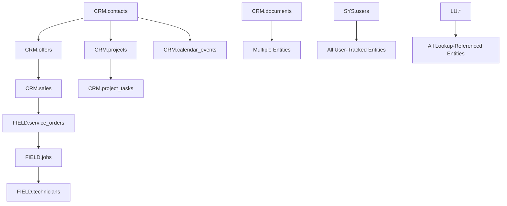

# Modules Structure Analysis & Database Migration

## Module Architecture Overview

The application follows a modular architecture with clear separation of concerns across CRM, Field Service, and System management domains.

### Core Module Categories

#### 1. **CRM Modules** 📊
- **contacts**: Customer relationship management, contact management, projects, and tasks
- **sales**: Sales pipeline, offers, and deal management  
- **projects**: Project management with kanban boards and task tracking
- **calendar**: Event scheduling and calendar management
- **articles**: Product/article inventory and service catalog
- **documents**: Document management and file attachments
- **workflow**: Business process automation and workflow management

#### 2. **Field Service Modules** 🔧
- **field**: Service orders, installations, technician management, and field inventory
- **dispatcher**: Job scheduling, technician dispatch, and location tracking
- **scheduling**: Integration layer for technician scheduling

#### 3. **System Modules** ⚙️  
- **system**: User management, roles, settings, audit trails, and notifications
- **lookups**: Reference data and configuration tables

## Database Naming Convention

All database tables follow a strict naming convention for easy identification and organization:

- **`CRM.*`** - Customer Relationship Management tables
- **`FIELD.*`** - Field Service Management tables  
- **`LU.*`** - Lookup/Reference tables
- **`SYS.*`** - System configuration and management tables

## Module Relationships & Data Flow

### Key Entity Relationships



### Business Process Flow

1. **Lead to Customer**: `CRM.contacts` → status progression
2. **Sales Process**: `CRM.contacts` → `CRM.offers` → `CRM.sales`
3. **Service Delivery**: `CRM.sales` → `FIELD.service_orders` → `FIELD.jobs` → `FIELD.technicians`
4. **Project Management**: `CRM.contacts` → `CRM.projects` → `CRM.project_tasks`
5. **Documentation**: All entities can have attached `CRM.documents`

## Migration Files Structure

Each module contains a `migrations/` folder with JSON schema definitions:

```
src/modules/
├── contacts/migrations/001_crm_tables.json
├── sales/migrations/001_crm_sales_tables.json  
├── field/migrations/001_field_tables.json
├── articles/migrations/001_crm_articles_tables.json
├── calendar/migrations/001_crm_calendar_tables.json
├── projects/migrations/001_crm_projects_tables.json
├── documents/migrations/001_documents_tables.json
├── workflow/migrations/001_workflow_tables.json
├── dispatcher/migrations/001_field_dispatcher_tables.json
├── lookups/migrations/001_lookup_tables.json
└── system/migrations/001_system_tables.json
```

### Migration JSON Structure

Each migration file contains:

```json
{
  "module": "module_name",
  "version": "001", 
  "description": "Module description",
  "tables": [
    {
      "name": "SCHEMA.table_name",
      "primaryKey": "id",
      "fields": {
        "field_name": {
          "type": "string|integer|decimal|datetime|json|array|boolean",
          "required": true|false,
          "unique": true|false,
          "default": "default_value",
          "foreignKey": "SCHEMA.table.field",
          "enum": ["option1", "option2"]
        }
      },
      "indexes": ["field1", "field2"]
    }
  ]
}
```

## Cross-Module Dependencies

### Foreign Key Relationships

- **CRM.contacts** ← Referenced by offers, sales, projects, calendar events
- **FIELD.technicians** ← Referenced by service orders, jobs, schedules
- **SYS.users** ← Referenced by all user-tracked entities (created_by, modified_by)
- **LU.*** ← Referenced by entities requiring lookup values

### Polymorphic Relationships

- **CRM.documents**: Can attach to contacts, sales, offers, projects, service orders
- **CRM.calendar_events**: Can relate to contacts, sales, offers, projects, service orders
- **SYS.audit_trail**: Tracks changes across all entities

## Data Types Used

- **string**: Text fields, IDs, names, emails
- **integer**: Numbers, counts, durations in minutes
- **decimal**: Prices, rates, coordinates  
- **datetime**: Timestamps with timezone
- **date**: Date only fields
- **time**: Time only fields
- **boolean**: True/false flags
- **json**: Complex nested data structures
- **array**: Lists of strings or IDs

## Next Steps for Backend Integration

1. **Database Setup**: Use migration JSONs to create database schema
2. **API Endpoints**: Create CRUD endpoints following RESTful patterns
3. **Authentication**: Integrate with SYS.users and SYS.roles
4. **Audit Trail**: Implement automatic tracking via SYS.audit_trail
5. **File Storage**: Setup document storage system for CRM.documents
6. **Real-time Updates**: WebSocket integration for dispatcher and notifications

## Module-Specific Features

### CRM Modules
- Multi-project contact management
- Sales pipeline with stages
- Document attachments
- Calendar integration
- Workflow automation

### Field Service Modules  
- GPS tracking for technicians
- Real-time job dispatch
- Installation management
- Skills-based assignment
- Mobile-friendly interfaces

### System Modules
- Role-based permissions
- Comprehensive audit logging
- Configurable system settings
- Real-time notifications
- Multi-tenant support ready